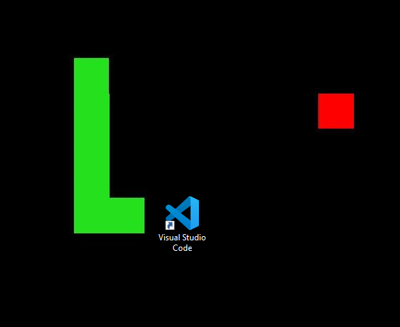

# Wallpaper_Snake
Snake game on your wallpaper.



# Controls

-Before Starting the Game:
Run the code and wait for a few seconds. Your wallpaper will turn black.

-To Start the Game:
  Press Enter.
  Use the Arrow keys to control the snake's direction.

# Required Modules
Make sure to install the necessary Python modules by running the following command:
```pip install keyboard Pillow```
